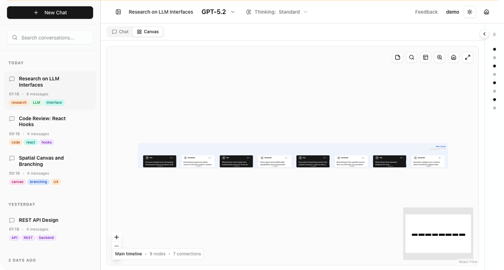
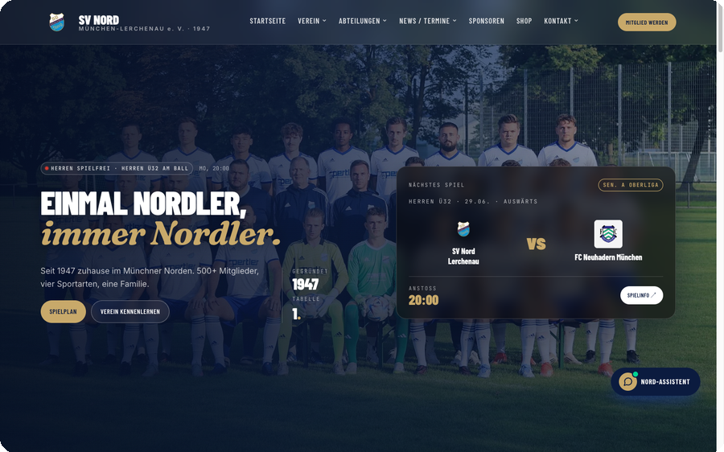
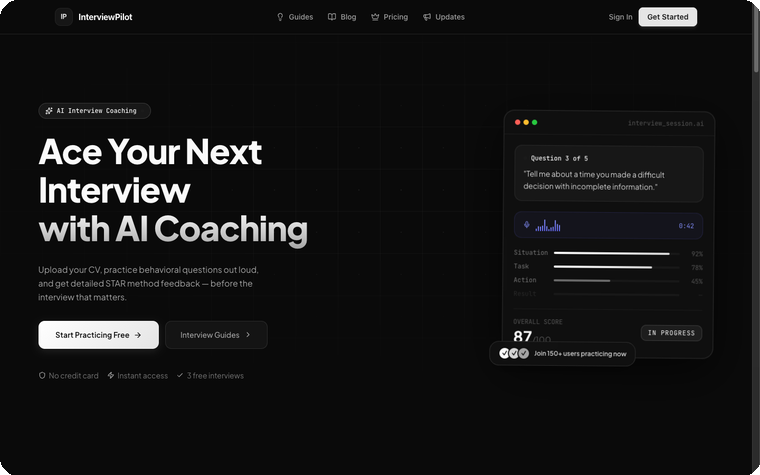
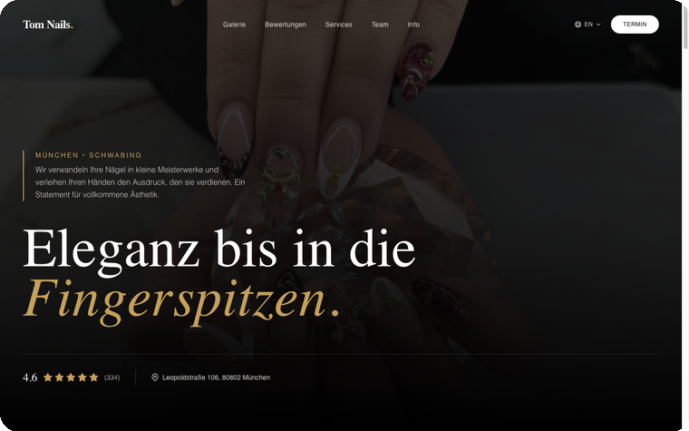
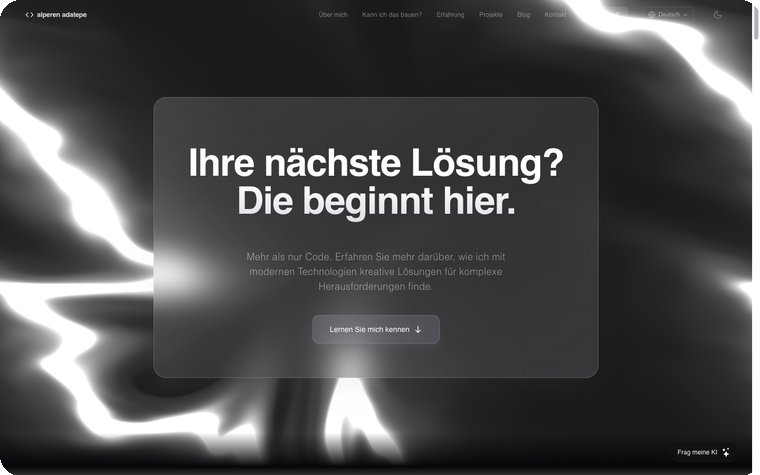

  

<b>Full-Stack Engineer @ BMW Group</b> &nbsp;·&nbsp; BMW Fastlane Scholar &nbsp;·&nbsp; LLMs &amp; autonomous agents

  
  &nbsp;
  

I design and ship full-stack and AI-powered products end to end: a thesis-grade spatial LLM interface, a live production website running for a real sports club, a suite of developer tools I use every day, and an AI calendar app on its own domain. Real deploys, real users, reachable at [adatepe.dev](https://adatepe.dev).

> **Open to** freelance projects now, and full-time full-stack &amp; LLM-engineering roles after my M.Sc. &nbsp;→&nbsp; **[Get in touch](https://adatepe.dev/#contact)**

## About Me

- **Software Engineer @ BMW Group** and **BMW Fastlane Scholar**, an 18-month program combining an M.Sc. with hands-on engineering at the BMW Group.
- **M.Sc. Informatik @ LMU** (B.Sc. Computer Science with minor in Statistics, completed).
- I build with **LLMs &amp; autonomous agents**: agent runners, RAG and tool-calling pipelines, and natural-language tooling, taking models from prompt to production with eval loops, cost/latency budgets, and streaming UIs.
- Former **Technical Project Lead @ PushQuantum**, where I led [wiqi](https://github.com/leart-zuka/wiqi) (explaining quantum technologies to everyone), and Academic Tutor for *Computer Networks &amp; Distributed Systems* @ LMU.

## Featured Projects

<table>
  <tr>
    <td colspan="2" align="center" valign="top">
      
       
      <b>CanvasConvo</b> &nbsp;·&nbsp; <a href="https://canvasconvo.adatepe.dev/demo">live demo</a> &nbsp;·&nbsp; My most complete product, technically and in UX: authenticated accounts, multiple external API integrations, real-time streaming, and conversation branching on a spatial canvas with voice input and multi-modal files. Grew a real, active user base. B.Sc. thesis.
    </td>
  </tr>
  <tr>
    <td width="50%" align="center" valign="top">
      
       
      <b><a href="https://github.com/noluyorAbi/nord-lerchenau">nord-lerchenau</a></b> &nbsp;·&nbsp; <a href="https://nord-lerchenau.vercel.app/">live</a> Modern rebuild of a real sports club's site: client-editable Payload CMS, live match and league data. Next.js 16.
    </td>
    <td width="50%" align="center" valign="top">
      
       
      <b>InterviewPilot</b> &nbsp;·&nbsp; <i>private beta</i> AI interview-prep SaaS: production Stripe billing, OAuth / OIDC, real-time voice scoring on the STAR method. Walkthrough on request.
    </td>
  </tr>
  <tr>
    <td width="50%" align="center" valign="top">
      
       
      <b>Tom Nails</b> &nbsp;·&nbsp; <a href="https://tomnails.de">live</a> Multilingual studio site: 16 languages, JSON-LD SEO, content-sync pipelines.
    </td>
    <td width="50%" align="center" valign="top">
      
       
      <b>adatepe.dev</b> &nbsp;·&nbsp; <a href="https://adatepe.dev">live</a> My portfolio: custom analytics, AI pipeline, 26-language i18n, 84 tests in CI.
    </td>
  </tr>
</table>

_Honorable mentions:_ [autonomous-agent-nightshift](https://github.com/noluyorAbi/autonomous-agent-nightshift) (published npm OSS, an AI coding-agent orchestrator) · [openAIScientist](https://github.com/noluyorAbi/openAIScientist) (R package, my most-starred repo) · [nitor-atelier](https://github.com/noluyorAbi/nitor-atelier) (cinematic client site, scroll-as-zoom concept, 551 Playwright tests) · [Workflow Tools](https://tools.adatepe.dev) (my own developer-tooling suite).

## Tech Stack

**Languages**
       

**Frontend**
    

**Backend & Data**
   

**AI / LLM**
 

**DevOps & Hosting**
  

## GitHub Stats

  

  
  

---

<b>noluyor abi?</b> &nbsp; Turkish for "what's up, bro?". My username greets you first, so we are basically friends already.

<i>Have a project in mind?</i> &nbsp;&nbsp; <a href="https://adatepe.dev/#contact"><b>Let's build it</b></a>

<a href="https://adatepe.dev">adatepe.dev</a> &nbsp;·&nbsp; <a href="https://in.adatepe.dev/">LinkedIn</a> &nbsp;·&nbsp; built with Next.js, TypeScript, and good coffee

